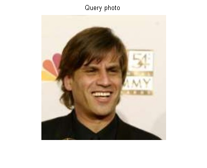

##Face Frontalization
To align a face in profile to front view. This system is an implemetation of paper "Effective Face Frontalization in Unconstrained Images".

Tal Hassner, Shai Harel, Eran Paz, Roee Enbar"

##Usage
frontalization [queryImage] [facialPointsFile] [3DModelFile]

(A demo : ./frontalization image.png ../data/facialFeaturePoint.yml  ../3DModel/model3D.yml  Before running the code, you should modify the "refU.txt" path in 3DModel/model3D.yml according to your settings. Otherwise, you will see "line: 73, file: ../frontalUtil.cpp, message: open /home/cheng/workshop/github/faceFrontalization/3DModel/refU.txt error")

####Parameters
frontalization : program name   
query image : input image    
facialPointsFile : facial feature points detected by SDM   
3DModelFile : predefined 3D model (already provided)    

##Demo
The left one is input image and the right one is output.

##Reference
"Effective Face Frontalization in Unconstrained Images"
by Tal Hassner, Shai Harel, Eran Paz, Roee Enbar

<!--
##Author
Write by Shaoguang Cheng.   
From Xi'an, China.   
Email : chengshaoguang1291@126.com
-->
